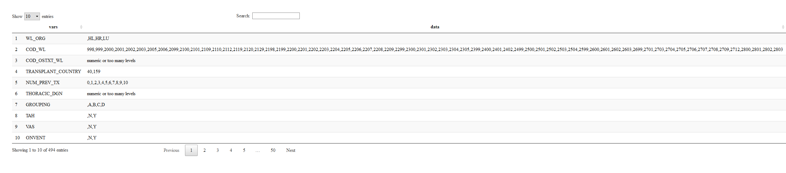

------------------------------------------------------------------------

In the following block, required ***R*** libraries are checked for existance and then installed if it's needed.

``` r
rm(list = ls()) # clears global environment (functions and variables)
graphics.off() # clears graphics
if(!("pacman" %in% rownames(installed.packages()))){install.packages("pacman")}# pacman would be installed if it's not existed
library(pacman) 
p_load(caret,httr, DT)
```

Here we check different values that a variable might have.

``` r
# first I download the data from github and then merge them into one large file named thoracic_data
{
file1<-readRDS(url("https://github.com/hamidahady/transplant/blob/master/data/raw/thoracic_data_1_9000L.rds?raw=true"))
file2<-readRDS(url("https://github.com/hamidahady/transplant/blob/master/data/raw/thoracic_data_9001_18000L.rds?raw=true"))
file3<-readRDS(url("https://github.com/hamidahady/transplant/blob/master/data/raw/thoracic_data_18001_27000L.rds?raw=true"))
file4<-readRDS(url("https://github.com/hamidahady/transplant/blob/master/data/raw/thoracic_data_27001_36000L.rds?raw=true"))

file5<-readRDS(url("https://github.com/hamidahady/transplant/blob/master/data/raw/thoracic_data_36001_45000L.rds?raw=true"))
file6<-readRDS(url("https://github.com/hamidahady/transplant/blob/master/data/raw/thoracic_data_45001_54000L.rds?raw=true"))
file7<-readRDS(url("https://github.com/hamidahady/transplant/blob/master/data/raw/thoracic_data_54001_63000L.rds?raw=true"))
file8<-readRDS(url("https://github.com/hamidahady/transplant/blob/master/data/raw/thoracic_data_63001_72000L.rds?raw=true"))
file9<-readRDS(url("https://github.com/hamidahady/transplant/blob/master/data/raw/thoracic_data_72001_81000L.rds?raw=true"))
file10<-readRDS(url("https://github.com/hamidahady/transplant/blob/master/data/raw/thoracic_data_81001_90000L.rds?raw=true"))
file11<-readRDS(url("https://github.com/hamidahady/transplant/blob/master/data/raw/thoracic_data_90001_99000L.rds?raw=true"))
file12<-readRDS(url("https://github.com/hamidahady/transplant/blob/master/data/raw/thoracic_data_99001_108000L.rds?raw=true"))
file13<-readRDS(url("https://github.com/hamidahady/transplant/blob/master/data/raw/thoracic_data_108001_117000L.rds?raw=true"))
file14<-readRDS(url("https://github.com/hamidahady/transplant/blob/master/data/raw/thoracic_data_117001_126000L.rds?raw=true"))
file15<-readRDS(url("https://github.com/hamidahady/transplant/blob/master/data/raw/thoracic_data_126001_135000L.rds?raw=true"))
file16<-readRDS(url("https://github.com/hamidahady/transplant/blob/master/data/raw/thoracic_data_135001_144000L.rds?raw=true"))
file17<-readRDS(url("https://github.com/hamidahady/transplant/blob/master/data/raw/thoracic_data_144001_153000L.rds?raw=true"))
file18<-readRDS(url("https://github.com/hamidahady/transplant/blob/master/data/raw/thoracic_data_153001_159318L.rds?raw=true"))


thoracic_data<-rbind(file1,file2,file3,file4,file5,file6,file7,file8,file9,file10,file11,file12,file13,file14,file15,file16,
                     file17,file18)

rm(list = c("file1","file2","file3","file4","file5","file6","file7","file8","file9","file10","file11","file12","file13",
            "file14","file15","file16","file17","file18"))
}
#####end of importing the data
  
var_table<-matrix(NA, ncol = 2, nrow = ncol(thoracic_data))
var_table<-as.data.frame(var_table)
names(var_table) <- c("vars","data")

var_table$vars<-colnames(thoracic_data)

for(i in 1:ncol(thoracic_data)){
  if(length(as.data.frame(table(thoracic_data[i]))[,1])<100){
    var_table$data[i]<-paste(as.data.frame(table(thoracic_data[i]))[,1],collapse=",")
  }else{var_table$data[i]<-"numeric or too many levels"}
  
  
}
```

<br /> <br /> If the levels of variables are more than 100, I assume they are numerical or there are uselessly too many levels. Some of variables are empty and some of them have a lot of levels (like states' name). Here, you can see possible values of different variables in the thoracic dataset:

``` r
  DT::datatable(var_table)
```



[1] Auburn University, <hamid@auburn.edu>

[2] University of Miami Ohio, <fmegahed@miamioh.edu>

[3] Dayton University, <ychen4@udayton.edu>

[4] Auburn University, <cje0010@auburn.edu>
